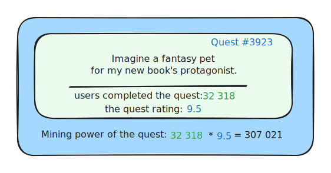

# ✨ Quest creation (10%)

Without motivation, authors create quests for no other reason than to promote their projects to the platform's audience, as can be seen on the popular existing quest platforms. This leads to the majority of quests being of very low quality, like silly tasks to join the Discord community or repost a tweet in X.

On the other hand, rewards for quests that are valued by the community create a very different economic situation. In this case, authors can create any kind of content and earn (without selling) by providing value to the community.

In order to achieve this, 10% of the newly created QFTs will be distributed each week to users who have created quests with an end date this week, based on the popularity and rating the quest received while it was active.

Each quest has an end date when it closes. At the end of the week, the system will collect all quests that have ended during the week and calculate each quest's mining power as the product of the quest completions and the quest's rating.


Since quest completion is moderated by the community, and quest ratings are based on a "majority wins" system, there is no way for malicious authors to abuse the system by creating a large number of pointless quests.


The current status: <mark style="background-color:orange;">coming in Questfall v1.0</mark>&#x20;

