# Crafting

Crafting controls Essence return, item level-up and merging costs, clothing evolution and perk quality.

## Live Status

Scrapping, Leveling, consumable Merging, clothing Rarity evolution and Quality are live. Merging reduces Potion/Gem/Dice Essence fees; Rarity reduces clothing evolution cost and Quality improves ordinary evolution and rerolls. The Gold-buyer Gem reward program is active.

The Admin **Crafting** section configures base Essence prices
for Upgrade, Evolve, Scrap, Max Out and Reroll, plus independent Merge quantities
and fees for each consumable and rarity. These values are stored as audited
database revisions and used by real server quotes and commands. Tables below
reflect the [30 September settings snapshot](../../../assets/economy-settings.md#crafting);
saved settings can change the base prices without changing trait curves, mastery
or grants. Quality remains a read-only calculator in Admin and affects Evolve
and Reroll results. Server quotes show the current payment before confirmation.

## How To Read These Tables

A trait value is the total character value for that trait after character points, item Aspect, attribute grants, and trait terminal perks. Direct grants are different: they do not increase the trait value itself, but modify the final system value after the trait is read.

The rarity columns show the generated range for one direct grant on one item. Multiple grants add together unless the trait text says they multiply, such as Stamina Relief pressure reduction.

Common (F) clothing has no perk slots, so direct grant ranges start at Uncommon (E).

Rarity letters in grant tables: E = Uncommon, D = Rare, C = Epic, B = Legendary, A = Mythical.

`pp` means percentage points: `+2 pp` changes a `8%` chance into `10%`, not into `8.16%`.

## Scrapping

**Status:** Live.

Scrapping destroys an item and returns two separate parts of Essence:

1. a guaranteed base value from the item's rarity;
2. a growing share of the Essence actually paid for its level upgrades.

Scrapping Uncommon (E) through Mythical (A) clothing also grants one Dice of the same rarity. The existing Luck proc for that scrap grants a second Dice, even when it adds no Essence because the item has no invested Essence. Common (F) clothing grants no Dice, and there is no Common Dice. Luck Bonus changes the Essence reward, but not the number of Dice. The Dice and Essence are granted together with the scrap in one transaction; the result shows the Dice count.

Dice are separate inventory items, each weighing as much as a Gem of the same rarity. They stack by rarity in Inventory and can be listed and sold one at a time on the Marketplace.

## Rerolling a Perk

Use one Dice on owned clothing of the same rarity, either carried or equipped, and pay the Essence fee below. Choose one existing perk; the replacement is generated immediately and cannot be declined after viewing it. It must differ in type, effect or condition, though its numerical value may be worse. Other item properties remain unchanged. The reroll fee is consumed by the attempt and is not added to the item's invested Essence.

| Clothing rarity | E | D | C | B | A |
| --- | ---: | ---: | ---: | ---: | ---: |
| Reroll Essence fee | 30 | 50 | 70 | 100 | 140 |

The existing Crafting Quality value biases the numerical roll. A newly rolled terminal perk starts with a value appropriate to the **current item level**, so rerolling high-level clothing does not reset that perk to level-one strength. If a valid replacement cannot be generated, the Dice, Essence and clothing remain untouched.

Every item stores its own **Essence invested** value. Only real payments are recorded, after any Lucky Discount. The value stays with the item when it is traded. It is shown in the large item popup in both Inventory and Marketplace, so a buyer can judge an item's scrapping value before purchase.

A newly generated item starts with zero invested Essence, but still returns its rarity base:

| Rarity | F | E | D | C | B | A |
| --- | ---: | ---: | ---: | ---: | ---: | ---: |
| Guaranteed base Essence | 10 | 20 | 30 | 40 | 50 | 60 |

The trait recovers an asymptotically growing share of invested Essence:

```text
t = log10(max(1, Scrapping))
trait_recovery = t² / (t² + 9)
```

It approaches `100%` but never reaches it at a finite trait value. Every completed mastery rank also adds `1` guaranteed Essence independently of rarity.

### Direct Grant Ranges

| Direct grant | What one grant changes | E | D | C | B | A |
| --- | --- | ---: | ---: | ---: | ---: | ---: |
| Base Scrapping Essence | Adds guaranteed Essence independently of investment. | +1 | +2 | +3 | +4 | +5 |
| Scrapping Recovery Efficiency | Closes part of the remaining gap between trait recovery and 100%. | +2 to +4 | +5 to +8 | +9 to +12 | +13 to +16 | +17 to +20 |

Recovery Efficiency does not add percentage points directly:

```text
final_recovery =
  1 - (1 - trait_recovery) / (1 + recovery_efficiency / 100)
```

<!-- trait-chart:crafting-scrapping:start -->
### Growth Chart



Essence returned from a Rare (D) item with 1,000 invested Essence. Includes rarity base, recovered investment and Mastery; excludes Lucky Scrapping.

The blue curve includes Mastery and no direct grants. Each additional grant curve applies **one maximum Mythical (A) grant**, independently of the other grants. The horizontal axis starts at 1 TU and is logarithmic.
<!-- trait-chart:crafting-scrapping:end -->

### Mastery Start Values

| Mastery | Trait value at start | Invested Essence recovered | Guaranteed mastery Essence |
| --- | ---: | ---: | ---: |
| Guest | `0` | 0% | +0 |
| Novice | `25` | 17.84% | +1 |
| Apprentice | `100` | 30.77% | +2 |
| Adept | `300` | 40.54% | +3 |
| Specialist | `1,000` | 50% | +4 |
| Expert | `3,000` | 57.33% | +5 |
| Master | `10,000` | 64% | +6 |
| Grandmaster | `30,000` | 69.01% | +7 |
| Wizard | `100,000` | 73.53% | +8 |
| Mystic | `300,000` | 76.92% | +9 |
| Immortal | `1,000,000` | 80% | +10 |
| Absolute | `3,000,000` | 82.34% | +11 |

### Lucky Scrapping

When Luck activates, it works only on the invested Essence still unrecovered after the guaranteed calculation. If the final Lucky Reward power is `Q`, Luck recovers this share of that remainder:

```text
lucky_remainder_share = Q / (Q + 100)
```

Luck therefore cannot return more than the remaining investment and never multiplies the rarity base, mastery reward, flat grants, or already recovered Essence.

### Examples

**Example 1.** Rare (D), `100 Essence` invested, Specialist Scrapping, one A flat grant `+5`

Guaranteed rarity and flat value: `30 + 4 mastery + 5 grant = 39`.

Investment recovery: `floor(100 x 50%) = 50`.

Result before Luck: `89 Essence`.

**Example 2.** Rare (D), `100 Essence` invested, Specialist Scrapping, one A Efficiency grant `+20`

Final recovery: `1 - (1 - 50%) / 1.2 = 58.33%`.

Result before Luck: `30 rarity + 4 mastery + floor(100 x 58.33%) = 92 Essence`.

If Luck activates with `Q = 100`, it recovers `50%` of the remaining `42 Essence`, adding `21 Essence`.

## Leveling

**Status:** Live.

Reduces the Essence cost of raising clothing level.

**How it resolves.** The base price is the target item level multiplied by its rarity scale:

| Rarity | F | E | D | C | B | A |
| --- | ---: | ---: | ---: | ---: | ---: | ---: |
| Leveling scale | 1 | 2 | 3 | 5 | 8 | 13 |

Leveling follows an asymptotic curve: it keeps reducing the remaining share of that base price without using a percentage floor. Every completed mastery rank adds `5 Leveling Efficiency`. Mastery and direct-grant Efficiency divide the remaining cost, so they have diminishing returns instead of subtracting direct percentage points. The final ordinary price has a minimum of `1 Essence`.

Item level has no product cap. The target-level factor keeps making each next upgrade more expensive, while item weight continues to grow with level.

A successful Lucky Discount is applied afterward. Only the Essence actually paid is recorded as invested in the item.

### Direct Grant Ranges

| Direct grant | What one grant changes | E | D | C | B | A |
| --- | --- | ---: | ---: | ---: | ---: | ---: |
| Leveling Efficiency | Divides the remaining level-up cost. | +1 to +2 | +3 to +4 | +5 to +6 | +7 to +8 | +9 to +10 |

<!-- trait-chart:crafting-leveling:start -->
### Growth Chart



Share of the base level-up price remaining after the trait and Mastery. Lower is better. Actual payment is rounded up and cannot fall below 1 Essence.

The blue curve includes Mastery and no direct grants. Each additional grant curve applies **one maximum Mythical (A) grant**, independently of the other grants. The horizontal axis starts at 1 TU and is logarithmic.
<!-- trait-chart:crafting-leveling:end -->

### Mastery Start Values

| Mastery | Trait value at start | Mastery Efficiency | Ordinary base cost remaining without direct grants |
| --- | ---: | ---: | ---: |
| Guest | `0` | 0 | 100% |
| Novice | `25` | 5 | 78.25% |
| Apprentice | `100` | 10 | 62.94% |
| Adept | `300` | 15 | 51.70% |
| Specialist | `1,000` | 20 | 41.67% |
| Expert | `3,000` | 25 | 34.14% |
| Master | `10,000` | 30 | 27.69% |
| Grandmaster | `30,000` | 35 | 22.95% |
| Wizard | `100,000` | 40 | 18.91% |
| Mystic | `300,000` | 45 | 15.92% |
| Immortal | `1,000,000` | 50 | 13.33% |
| Absolute | `3,000,000` | 55 | 11.40% |

### Examples

**Example 1.** Rare (D) item to level `10`, Specialist Leveling, no direct grant

Calculation: `30 x 50% x 100 / 120`, rounded up.

Result: `13 Essence` ordinary level-up cost.

**Example 2.** Rare (D) item to level `10`, Specialist Leveling, one A grant `+10 Efficiency`

Calculation: `30 x 50% x 100 / 130`, rounded up.

Result: `12 Essence` ordinary level-up cost.

If Luck activates, Lucky Discount is calculated from that ordinary price and can reduce the actual payment further.

## Merging

**Status:** Live for Potion, Gem and Dice merging.

Cost-efficiency trait for merging rarity-based consumables. The saved recipes use two matching Potions or five matching Gems or Dice. Admin can configure each transition independently. Each recipe has its own base Essence fee; Merging reduces that fee without changing the required number of items. See [Merge Recipes](../../../assets/economy-settings.md#merge-recipes).

**How it resolves.** The cost keeps a 25% core. Every completed Merging mastery rank adds `5 Merging Efficiency`. Mastery and direct-grant Efficiency are added together, then divide only the reducible 75% part of the cost.

### Direct Grant Ranges

| Direct grant | What one grant changes | E | D | C | B | A |
| --- | --- | ---: | ---: | ---: | ---: | ---: |
| Merge cost efficiency | Shrinks the reducible part of the merge cost. | +2% to +4% | +5% to +8% | +9% to +12% | +13% to +16% | +17% to +20% |

<!-- trait-chart:crafting-merging:start -->
### Growth Chart



Share of the base merge price remaining, including Mastery. Lower is better; the curve retains a 25% soft core. Actual payment is rounded up.

The blue curve includes Mastery and no direct grants. Each additional grant curve applies **one maximum Mythical (A) grant**, independently of the other grants. The horizontal axis starts at 1 TU and is logarithmic.
<!-- trait-chart:crafting-merging:end -->

### Mastery Start Values

| Mastery | Trait value at start | Mastery Efficiency | Merge cost remaining without direct grants |
| --- | ---: | ---: | ---: |
| Guest | `0` | 0 | 100% |
| Novice | `25` | +5 | 80.84% |
| Apprentice | `100` | +10 | 68.39% |
| Adept | `300` | +15 | 59.75% |
| Specialist | `1,000` | +20 | 52.34% |
| Expert | `3,000` | +25 | 47% |
| Master | `10,000` | +30 | 42.56% |
| Grandmaster | `30,000` | +35 | 39.38% |
| Wizard | `100,000` | +40 | 36.72% |
| Mystic | `300,000` | +45 | 34.79% |
| Immortal | `1,000,000` | +50 | 33.14% |
| Absolute | `3,000,000` | +55 | 31.92% |

### Examples

**Example 1.** Rare (D) Gem merge base `90 Essence`, Specialist Merging, no direct grant

Calculation: `25% core + 75% reducible curve / (1 + 20 mastery Efficiency / 100)`.

Result: `48 Essence` merge cost.

**Example 2.** Rare (D) Gem merge base `90 Essence`, Specialist Merging, one A grant `+20 Efficiency`

Calculation: `25% core + 75% reducible curve / (1 + (20 mastery + 20 grant) Efficiency / 100)`.

Result: `44 Essence` merge cost.

## Rarity

**Status:** Live.

Cost-efficiency trait for clothing evolution with one matching Gem and Essence.

**How it resolves.** The cost keeps a 20% core. Every completed Rarity mastery rank adds `5 Rarity Efficiency`. Mastery and direct-grant Efficiency are added together, then divide only the reducible 80% Essence fee. One Gem of the source rarity is required.

The current base is `ceil(coefficient × sqrt(current item level))`, before the
Rarity discount. The source-rarity coefficients are:

| Transition | F → E | E → D | D → C | C → B | B → A |
| --- | ---: | ---: | ---: | ---: | ---: |
| Base Essence coefficient | 10 | 40 | 90 | 160 | 250 |

Mythical clothing cannot evolve further. The level-10 Rare example below uses
`ceil(90 × sqrt(10)) = 285 Essence` as its base.

### Direct Grant Ranges

| Direct grant | What one grant changes | E | D | C | B | A |
| --- | --- | ---: | ---: | ---: | ---: | ---: |
| Rarity upgrade efficiency | Shrinks the reducible part of the rarity-upgrade cost. | +3% to +5% | +6% to +10% | +11% to +15% | +16% to +20% | +21% to +25% |

<!-- trait-chart:crafting-rarity:start -->
### Growth Chart



Share of the base rarity-evolution price remaining, including Mastery. Lower is better; the curve retains a 20% soft core. Actual payment is rounded up.

The blue curve includes Mastery and no direct grants. Each additional grant curve applies **one maximum Mythical (A) grant**, independently of the other grants. The horizontal axis starts at 1 TU and is logarithmic.
<!-- trait-chart:crafting-rarity:end -->

### Mastery Start Values

| Mastery | Trait value at start | Mastery Efficiency | Rarity-upgrade cost remaining without direct grants |
| --- | ---: | ---: | ---: |
| Guest | `0` | 0 | 100% |
| Novice | `25` | +5 | 82.6% |
| Apprentice | `100` | +10 | 70.35% |
| Adept | `300` | +15 | 61.36% |
| Specialist | `1,000` | +20 | 53.33% |
| Expert | `3,000` | +25 | 47.31% |
| Master | `10,000` | +30 | 42.15% |
| Grandmaster | `30,000` | +35 | 38.36% |
| Wizard | `100,000` | +40 | 35.13% |
| Mystic | `300,000` | +45 | 32.73% |
| Immortal | `1,000,000` | +50 | 30.67% |
| Absolute | `3,000,000` | +55 | 29.12% |

### Examples

**Example 1.** Rare (D) level `10` rarity-upgrade base `285 Essence`, Specialist Rarity, no direct grant

Calculation: `20% core + 80% reducible curve / (1 + 20 mastery Efficiency / 100)`.

Result: `152 Essence` rarity-upgrade cost.

**Example 2.** Rare (D) level `10` rarity-upgrade base `285 Essence`, Specialist Rarity, one A grant `+25% efficiency`

Calculation: `20% core + 80% reducible curve / (1 + (20 mastery + 25 grant) Efficiency / 100)`.

Result: `136 Essence` rarity-upgrade cost.

## Quality

**Status:** Live.

Perk-roll pressure for existing and newly generated perks during clothing evolution.

**How it resolves.** Every completed Quality mastery rank adds `1 Quality Pressure`. Trait pressure, mastery pressure, and direct-grant pressure combine before the final roll floor is derived. Quality applies only to crafting operations: it does not improve Lootbox drops or rewrite value already accumulated by a perk.

**Perfect clothing:** Max Out with one Mythical Gem and the configured fee, currently 500 Essence, permanently gives maximum perks and Aspect, including full current-rarity growth history. Quality does not affect its numeric values. Upgrade and Evolve retain these maxima; a new evolution perk is still chosen randomly. This fee is independent of rarity, level, Crafting and Luck. It counts as invested Essence for Scrapping. Ordinary Upgrade/Evolve costs are unchanged. See [Gems](../rpg-items/gems.md#mythical-gem-max-out--perfect).

### Direct Grant Ranges

| Direct grant | What one grant changes | E | D | C | B | A |
| --- | --- | ---: | ---: | ---: | ---: | ---: |
| Perk roll quality pressure | Adds roll pressure before the quality bias curve. | +1 pressure to +2 pressure | +2 pressure to +3 pressure | +3 pressure to +4 pressure | +4 pressure to +5 pressure | +5 pressure to +6 pressure |

<!-- trait-chart:crafting-quality:start -->
### Growth Chart



Minimum share of the remaining quality gap closed by an improvement. This is a roll floor, not the average result or the absolute final quality.

The blue curve includes Mastery and no direct grants. Each additional grant curve applies **one maximum Mythical (A) grant**, independently of the other grants. The horizontal axis starts at 1 TU and is logarithmic.
<!-- trait-chart:crafting-quality:end -->

### Mastery Start Values

| Mastery | Trait value at start | Mastery Pressure | Roll floor without direct grants |
| --- | ---: | ---: | ---: |
| Guest | `0` | 0 | 0% |
| Novice | `25` | +1 | 16.55% |
| Apprentice | `100` | +2 | 28.5% |
| Adept | `300` | +3 | 37.51% |
| Specialist | `1,000` | +4 | 45.74% |
| Expert | `3,000` | +5 | 52.22% |
| Master | `10,000` | +6 | 58.06% |
| Grandmaster | `30,000` | +7 | 62.6% |
| Wizard | `100,000` | +8 | 66.7% |
| Mystic | `300,000` | +9 | 69.91% |
| Immortal | `1,000,000` | +10 | 72.83% |
| Absolute | `3,000,000` | +11 | 75.14% |

### Examples

**Example 1.** Specialist Quality, one C grant `+4 pressure`

Calculation: `9 trait pressure + 4 mastery pressure + 4 grant pressure`.

Result: `52.10%` roll floor.

**Example 2.** Specialist Quality, one A grant `+6 pressure`

Calculation: `9 trait pressure + 4 mastery pressure + 6 grant pressure`.

Result: `54.70%` roll floor.

For an existing terminal, this floor improves only the remaining distance from its current roll to `100%`. The terminal's accumulated value stays unchanged; only its future per-level step is recalculated.
