# Stamina

Stamina controls action cost, maximum stamina, recovery, equipment pressure, and planned potion absorption.

## Implementation Status

Efficiency, Reserve, Recovery, and Relief are live. Moderated quest submissions and reports spend Stamina; the base cost of 1 is adjusted by Efficiency, Relief, and equipment weight. Automatic Question, Quiz, and Survey answer submissions do not currently spend Stamina. The character state applies the current maximum and recovery rules. Absorption remains planned until potion consumption is available.

## How To Read These Tables

A trait value is the total character value for that trait after character points, item Aspect, attribute grants, and trait terminal perks. Direct grants are different: they do not increase the trait value itself, but modify the final system value after the trait is read.

Mastery uses this final trait value, including boosted terminal perks. A boosted terminal perk may therefore unlock a mastery rank. Direct system grants do not add trait value. The mastery reward is applied once and is not recursively fed back into mastery or multiplied again by a booster.

The rarity columns show the generated range for one direct grant on one item. Multiple grants add together unless the trait text says they multiply, such as Stamina Relief pressure reduction.

Common (F) clothing has no perk slots, so direct grant ranges start at Uncommon (E).

Rarity letters in grant tables: E = Uncommon, D = Rare, C = Epic, B = Legendary, A = Mythical.

`pp` means percentage points: `+2 pp` changes a `8%` chance into `10%`, not into `8.16%`.

## Efficiency

**Status:** Live in character Stamina and supported action costs.

Reduces the base stamina cost of actions before equipment pressure is added.

**How it resolves.** Every reached Efficiency mastery rank reduces raw base action cost by `1 pp`. This mastery reward and direct rate grants add together, up to a combined `90%` reduction. Flat grants are subtracted next. The Efficiency trait multiplier is applied after all three pre-curve effects.

The shared mastery-input rule above applies to Efficiency.

### Direct Grant Ranges

| Direct grant | What one grant changes | E | D | C | B | A |
| --- | --- | ---: | ---: | ---: | ---: | ---: |
| Base stamina cost reduction | Reduces raw base action cost by percent before the trait multiplier. | +1% | +2% | +3% | +4% | +5% |
| Flat stamina cost reduction | Subtracts stamina from raw base action cost before the trait multiplier. | -1 stamina | -1 stamina to -2 stamina | -2 stamina to -3 stamina | -3 stamina to -4 stamina | -4 stamina to -5 stamina |

<!-- trait-chart:stamina-efficiency:start -->
### Growth Chart

Base cost of an action that normally costs 100 Stamina, before equipped-weight pressure. Lower is better. The backend applies its usual rounding.

The blue curve includes Mastery and no direct grants. Each additional grant curve applies **one maximum Mythical (A) grant**, independently of the other grants. The horizontal axis starts at 1 TU and is logarithmic.
<!-- trait-chart:stamina-efficiency:end -->

### Mastery Start Values

| Mastery | Trait value at start | System value without direct grants |
| --- | ---: | --- |
| Guest | `0` | 100% raw base action cost remains; `+0 pp` from mastery |
| Novice | `25` | 89% remains; `+1 pp` from mastery |
| Apprentice | `100` | 79% remains; `+2 pp` from mastery |
| Adept | `300` | 71% remains; `+3 pp` from mastery |
| Specialist | `1,000` | 63% remains; `+4 pp` from mastery |
| Expert | `3,000` | 56% remains; `+5 pp` from mastery |
| Master | `10,000` | 49% remains; `+6 pp` from mastery |
| Grandmaster | `30,000` | 44% remains; `+7 pp` from mastery |
| Wizard | `100,000` | 39% remains; `+8 pp` from mastery |
| Mystic | `300,000` | 36% remains; `+9 pp` from mastery |
| Immortal | `1,000,000` | 32% remains; `+10 pp` from mastery |
| Absolute | `3,000,000` | 29% remains; `+11 pp` from mastery |

### Examples

**Example 1.** Raw action cost `100`, Specialist Efficiency, one A rate grant `+5%`

Calculation: `100 x (100% - 4% mastery - 5% grant) x 0.6478`, rounded up.

Result: `59 stamina` base action cost.

**Example 2.** Raw action cost `100`, Specialist Efficiency, one A flat grant `-5 stamina`

Calculation: `(100 x 96% - 5) x 0.6478`, rounded up.

Result: `59 stamina` base action cost.

## Absorption

**Status:** Planned.

Planned trait for improving future Stamina Potion effects.

**How it resolves.** Every reached Absorption mastery rank adds `5 pp` to the starting Potion Effect bonus. This reward and direct Absorption grants add together, up to `250%`. The trait then scales the remaining distance toward the same `250%` effect ceiling.

The shared mastery-input rule above applies to Absorption.

### Direct Grant Ranges

| Direct grant | What one grant changes | E | D | C | B | A |
| --- | --- | ---: | ---: | ---: | ---: | ---: |
| Stamina Potion effect | Adds percentage points to potion effect before the trait curve. | +2% to +3% | +4% to +6% | +7% to +9% | +10% to +12% | +13% to +15% |

<!-- trait-chart:stamina-absorption:start -->
### Growth Chart

Additional recovery from a Stamina Potion, up to +250%. Potion integration is planned; this plots the RPG formula.

The blue curve includes Mastery and no direct grants. Each additional grant curve applies **one maximum Mythical (A) grant**, independently of the other grants. The horizontal axis starts at 1 TU and is logarithmic.
<!-- trait-chart:stamina-absorption:end -->

### Mastery Start Values

| Mastery | Trait value at start | System value without direct grants |
| --- | ---: | --- |
| Guest | `0` | +0% potion effect |
| Novice | `25` | +35.01% potion effect; `+5 pp` mastery seed |
| Apprentice | `100` | +63.33% potion effect; `+10 pp` mastery seed |
| Adept | `300` | +86.61% potion effect; `+15 pp` mastery seed |
| Specialist | `1,000` | +110% potion effect; `+20 pp` mastery seed |
| Expert | `3,000` | +129.27% potion effect; `+25 pp` mastery seed |
| Master | `10,000` | +147.33% potion effect; `+30 pp` mastery seed |
| Grandmaster | `30,000` | +161.59% potion effect; `+35 pp` mastery seed |
| Wizard | `100,000` | +174.62% potion effect; `+40 pp` mastery seed |
| Mystic | `300,000` | +184.77% potion effect; `+45 pp` mastery seed |
| Immortal | `1,000,000` | +194% potion effect; `+50 pp` mastery seed |
| Absolute | `3,000,000` | +201.21% potion effect; `+55 pp` mastery seed |

### Examples

**Example 1.** Future potion with `100` base effect, Specialist Absorption, no direct grant

Calculation: `20 pp mastery seed` becomes a `+110%` bonus through the trait curve; `100 x (1 + 110%)`.

Result: `210` effective potion value.

**Example 2.** Future potion with `100` base effect, Specialist Absorption, one A grant `+15 pp`

Calculation: `20 pp mastery + 15 pp grant` becomes a `+119.13%` bonus through the trait curve; `100 x (1 + 119.13%)`.

Result: `219.13` effective potion value.

Before potion use is activated, the potion system will define base restore values and any practical overflow limit. The Absorption formula itself is already fixed.

## Reserve

**Status:** Live in character Stamina and supported action costs.

Increases Maximum Stamina, letting a character perform more actions before resting or using future potions.

**How it resolves.** The Reserve trait creates the base stamina pool. Every reached Reserve mastery rank adds `2 pp` Maximum Stamina. This mastery reward and direct percentage grants add together before scaling the base pool; flat grants add stamina on top.

The shared mastery-input rule above applies to Reserve.

### Direct Grant Ranges

| Direct grant | What one grant changes | E | D | C | B | A |
| --- | --- | ---: | ---: | ---: | ---: | ---: |
| Flat Maximum Stamina | Adds Maximum Stamina directly. | +100 stamina to +250 stamina | +251 stamina to +500 stamina | +501 stamina to +1,000 stamina | +1,001 stamina to +2,000 stamina | +2,001 stamina to +5,000 stamina |
| Maximum Stamina percent | Scales the trait-derived stamina pool. | +2% to +3% | +4% to +6% | +7% to +9% | +10% to +12% | +13% to +15% |

<!-- trait-chart:stamina-reserve:start -->
### Growth Chart

Maximum Stamina, including starter reserve and Mastery. The vertical axis is logarithmic. This is capacity, not the current Stamina balance.

The blue curve includes Mastery and no direct grants. Each additional grant curve applies **one maximum Mythical (A) grant**, independently of the other grants. The horizontal axis starts at 1 TU and is logarithmic.
<!-- trait-chart:stamina-reserve:end -->

### Mastery Start Values

| Mastery | Trait value at start | System value without direct grants |
| --- | ---: | --- |
| Guest | `0` | 2,208 Maximum Stamina |
| Novice | `25` | 2,742 Maximum Stamina; `+2 pp` from mastery |
| Apprentice | `100` | 3,375 Maximum Stamina; `+4 pp` from mastery |
| Adept | `300` | 4,351 Maximum Stamina; `+6 pp` from mastery |
| Specialist | `1,000` | 6,489 Maximum Stamina; `+8 pp` from mastery |
| Expert | `3,000` | 10,695 Maximum Stamina; `+10 pp` from mastery |
| Master | `10,000` | 21,266 Maximum Stamina; `+12 pp` from mastery |
| Grandmaster | `30,000` | 44,172 Maximum Stamina; `+14 pp` from mastery |
| Wizard | `100,000` | 105,888 Maximum Stamina; `+16 pp` from mastery |
| Mystic | `300,000` | 245,494 Maximum Stamina; `+18 pp` from mastery |
| Immortal | `1,000,000` | 632,118 Maximum Stamina; `+20 pp` from mastery |
| Absolute | `3,000,000` | 1,520,649 Maximum Stamina; `+22 pp` from mastery |

### Examples

**Example 1.** Specialist Reserve, one A flat grant `+5,000 stamina`

Calculation: `floor(6,009 x 108%) + 5,000`.

Result: `11,489` Maximum Stamina.

**Example 2.** Specialist Reserve, one A percent grant `+15%`

Calculation: `floor(6,009 x (100% + 8% mastery + 15% grant))`.

Result: `7,391` Maximum Stamina.

## Recovery

**Status:** Live in character Stamina and supported action costs.

Increases stamina recovered per minute.

**How it resolves.** Recovery starts from the trait-derived base reserve divided by 480. Every reached Recovery mastery rank adds `2 pp` Recovery Speed. This mastery reward and direct percentage grants add together before scaling base recovery; flat grants add stamina per minute on top.

The shared mastery-input rule above applies to Recovery. Because Reserve uses the same `+2 pp` reward, equal Reserve and Recovery values without direct grants refill an empty bar in approximately `8 hours` at every mastery band.

### Direct Grant Ranges

| Direct grant | What one grant changes | E | D | C | B | A |
| --- | --- | ---: | ---: | ---: | ---: | ---: |
| Flat stamina recovery | Adds stamina recovered per minute. | +4 stamina/min to +8 stamina/min | +12 stamina/min to +16 stamina/min | +20 stamina/min to +24 stamina/min | +28 stamina/min to +32 stamina/min | +36 stamina/min to +40 stamina/min |
| Stamina recovery speed | Scales stamina recovery speed by percent. | +2% to +3% | +4% to +6% | +7% to +9% | +10% to +12% | +13% to +15% |

<!-- trait-chart:stamina-recovery:start -->
### Growth Chart

Stamina recovered per minute, including Mastery. The vertical axis is logarithmic. This is a rate, not time to refill a separate Reserve build.

The blue curve includes Mastery and no direct grants. Each additional grant curve applies **one maximum Mythical (A) grant**, independently of the other grants. The horizontal axis starts at 1 TU and is logarithmic.
<!-- trait-chart:stamina-recovery:end -->

### Mastery Start Values

| Mastery | Trait value at start | System value without direct grants |
| --- | ---: | --- |
| Guest | `0` | 4.6 stamina/min |
| Novice | `25` | 5.71 stamina/min; `+2 pp` from mastery |
| Apprentice | `100` | 7.03 stamina/min; `+4 pp` from mastery |
| Adept | `300` | 9.07 stamina/min; `+6 pp` from mastery |
| Specialist | `1,000` | 13.52 stamina/min; `+8 pp` from mastery |
| Expert | `3,000` | 22.28 stamina/min; `+10 pp` from mastery |
| Master | `10,000` | 44.31 stamina/min; `+12 pp` from mastery |
| Grandmaster | `30,000` | 92.03 stamina/min; `+14 pp` from mastery |
| Wizard | `100,000` | 220.6 stamina/min; `+16 pp` from mastery |
| Mystic | `300,000` | 511.45 stamina/min; `+18 pp` from mastery |
| Immortal | `1,000,000` | 1,316.91 stamina/min; `+20 pp` from mastery |
| Absolute | `3,000,000` | 3,168.02 stamina/min; `+22 pp` from mastery |

### Examples

**Example 1.** Specialist Recovery, one A flat grant `+40 stamina/min`

Calculation: `12.51875 x 108% + 40`.

Result: `53.52 stamina/min`.

**Example 2.** Specialist Recovery, one A percent grant `+15%`

Calculation: `12.51875 x (100% + 8% mastery + 15% grant)`.

Result: `15.4 stamina/min`.

## Relief

**Status:** Live in character Stamina and supported action costs.

Reduces the stamina pressure created by equipped item weight.

**How it resolves.** Every reached Relief mastery rank makes total equipped weight count as `1%` less for stamina pressure, up to a distant `90%` safety cap. Pressure is calculated from the square of that effective weight. Direct Relief grants reduce the resulting raw pressure, then the Relief trait divides what remains by its power.

The shared mastery-input rule above applies to Relief. Stored item weight and inventory weight do not change.

### Direct Grant Ranges

| Direct grant | What one grant changes | E | D | C | B | A |
| --- | --- | ---: | ---: | ---: | ---: | ---: |
| Equipment pressure reduction | Reduces raw equipment stamina pressure before the trait reduction. | +2% to +3% | +4% to +6% | +7% to +9% | +10% to +12% | +13% to +15% |

<!-- trait-chart:stamina-relief:start -->
### Growth Chart

Extra action-cost pressure from 10 kg of equipped items. Lower is better; 25% pressure means a 1.25 multiplier on base action cost. Carried inventory is excluded.

The blue curve includes Mastery and no direct grants. Each additional grant curve applies **one maximum Mythical (A) grant**, independently of the other grants. The horizontal axis starts at 1 TU and is logarithmic.
<!-- trait-chart:stamina-relief:end -->

### Mastery Start Values

| Mastery | Trait value at start | Weight used for pressure | System value without direct grants |
| --- | ---: | ---: | --- |
| Guest | `0` | 100% | 100% equipment pressure remains |
| Novice | `25` | 99% | 66.22% equipment pressure remains |
| Apprentice | `100` | 98% | 48.02% equipment pressure remains |
| Adept | `300` | 97% | 37.19% equipment pressure remains |
| Specialist | `1,000` | 96% | 28.36% equipment pressure remains |
| Expert | `3,000` | 95% | 22.45% equipment pressure remains |
| Master | `10,000` | 94% | 17.67% equipment pressure remains |
| Grandmaster | `30,000` | 93% | 14.39% equipment pressure remains |
| Wizard | `100,000` | 92% | 11.67% equipment pressure remains |
| Mystic | `300,000` | 91% | 9.75% equipment pressure remains |
| Immortal | `1,000,000` | 90% | 8.1% equipment pressure remains |
| Absolute | `3,000,000` | 89% | 6.9% equipment pressure remains |

### Examples

**Example 1.** Equipped weight `10 kg`, Specialist Relief, no direct grant

Calculation: mastery makes weight count as `9.6 kg`; `floor(9.6^2) = 92` raw pressure; `ceil(92 x 100 / (100 + 225))`.

Result: `29` pressure points remain.

**Example 2.** Equipped weight `10 kg`, Specialist Relief, one A grant `+15%`

Calculation: `ceil(92 x 85% x 100 / (100 + 225))`.

Result: `25` pressure points remain.
