# Trading

Trading controls seller fees, conversion, listing slots, and planned auction/liquidity surfaces.

## Live Status

Fee, Conversion, and Slots are live. Bid and Liquidity have finalized RPG models, but their auction and Gem Points surfaces are planned.

## How To Read These Tables

A trait value is the total character value for that trait after character points, item Aspect, attribute grants, and trait terminal perks. Direct grants are different: they do not increase the trait value itself, but modify the final system value after the trait is read.

The rarity columns show the generated range for one direct grant on one item. Multiple grants add together unless the trait text says they multiply, such as Stamina Relief pressure reduction.

Common (F) clothing has no perk slots, so direct grant ranges start at Uncommon (E).

Rarity letters in grant tables: E = Uncommon, D = Rare, C = Epic, B = Legendary, A = Mythical.

`pp` means percentage points: `+2 pp` changes a `8%` chance into `10%`, not into `8.16%`.

## Fee

**Status:** Live.

Reduces the marketplace commission paid by the seller when an item sells.

**How it resolves.** The fee has a 3% soft core and a reducible part between 30% and 3%. Every mastery rank gives +5 Fee Efficiency. Mastery efficiency and Fee grants add together, then make only the reducible part shrink faster. They do not subtract percentage points directly from the final fee. The listing form is an estimate from the seller's current build; the final rate uses the seller's build when the buyer completes the purchase. Luck can reduce that fee further, and the final Gold fee is rounded down to a whole number.

### Direct Grant Ranges

| Direct grant | What one grant changes | E | D | C | B | A |
| --- | --- | ---: | ---: | ---: | ---: | ---: |
| Marketplace fee efficiency | Shrinks the reducible part of the seller fee. | +3% to +5% | +6% to +10% | +11% to +15% | +16% to +20% | +21% to +25% |

<!-- trait-chart:trading-fee:start -->
### Growth Chart

Seller commission before Lucky Discount. Lower is better; the curve retains a 3% soft core. The final Gold fee is rounded down.

The blue curve includes Mastery and no direct grants. Each additional grant curve applies **one maximum Mythical (A) grant**, independently of the other grants. The horizontal axis starts at 1 TU and is logarithmic.

[Chart guide and interactive explorer](trait-charts.md).
<!-- trait-chart:trading-fee:end -->

### Mastery Start Values

| Mastery | Trait value at start | System value without direct grants |
| --- | ---: | --- |
| Guest | `0` | 30% seller fee |
| Novice | `25` | 24.13% seller fee |
| Apprentice | `100` | 19.99% seller fee |
| Adept | `300` | 16.96% seller fee |
| Specialist | `1,000` | 14.25% seller fee |
| Expert | `3,000` | 12.22% seller fee |
| Master | `10,000` | 10.48% seller fee |
| Grandmaster | `30,000` | 9.2% seller fee |
| Wizard | `100,000` | 8.11% seller fee |
| Mystic | `300,000` | 7.3% seller fee |
| Immortal | `1,000,000` | 6.6% seller fee |
| Absolute | `3,000,000` | 6.08% seller fee |

### Examples

These examples assume Luck does not activate on the sale.

**Example 1.** `1,000 Gold` item sale, Specialist Fee, no direct grant

Calculation: `1,000 x 14.25%`, rounded down to whole Gold.

Result: `142 Gold` seller fee.

**Example 2.** `1,000 Gold` item sale, Specialist Fee, one A grant `+25% efficiency`

Calculation: `1,000 x 12.31%`, rounded down to whole Gold.

Result: `123 Gold` seller fee.

## Bid

**Status:** RPG model finalized; auction surface planned.

Planned auction trait that makes the same Gold bid compete as a stronger offer.

**How it resolves.** Bid has an 80% soft core and a reducible 20% price part. Every mastery rank gives +5 Bid Efficiency. Mastery efficiency and Bid grants add together, then make only the reducible part shrink faster. They do not subtract percentage points directly, and they never change the actual settlement price.

### Direct Grant Ranges

| Direct grant | What one grant changes | E | D | C | B | A |
| --- | --- | ---: | ---: | ---: | ---: | ---: |
| Auction bid efficiency | Improves the effective bid power of Gold auction offers. | +3% to +5% | +6% to +10% | +11% to +15% | +16% to +20% | +21% to +25% |

<!-- trait-chart:trading-bid:start -->
### Growth Chart

Effective sorting price as a share of the actual Gold bid. Lower is better; settlement still uses the actual bid. Auction surface is planned.

The blue curve includes Mastery and no direct grants. Each additional grant curve applies **one maximum Mythical (A) grant**, independently of the other grants. The horizontal axis starts at 1 TU and is logarithmic.

[Chart guide and interactive explorer](trait-charts.md).
<!-- trait-chart:trading-bid:end -->

### Mastery Start Values

| Mastery | Trait value at start | System value without direct grants |
| --- | ---: | --- |
| Guest | `0` | +0% auction bid power |
| Novice | `25` | +4.35% auction bid power |
| Apprentice | `100` | +7.41% auction bid power |
| Adept | `300` | +9.66% auction bid power |
| Specialist | `1,000` | +11.67% auction bid power |
| Expert | `3,000` | +13.17% auction bid power |
| Master | `10,000` | +14.46% auction bid power |
| Grandmaster | `30,000` | +15.41% auction bid power |
| Wizard | `100,000` | +16.22% auction bid power |
| Mystic | `300,000` | +16.82% auction bid power |
| Immortal | `1,000,000` | +17.33% auction bid power |
| Absolute | `3,000,000` | +17.72% auction bid power |

### Examples

**Example 1.** Planned auction, listed price `1,000 Gold`, Specialist Bid, no direct grant

Calculation: `1,000 x 88.3333%` effective sorting price.

Result: `883.33 Gold` effective sorting price. The actual bid remains `1,000 Gold`.

**Example 2.** Planned auction, listed price `1,000 Gold`, Specialist Bid, one A grant `+25% efficiency`

Calculation: `1,000 x 86.8966%` effective sorting price.

Result: `868.97 Gold` effective sorting price. The actual bid remains `1,000 Gold`.

## Liquidity

**Status:** RPG model finalized; Gem Points surface planned.

Planned Gem Points efficiency trait for liquidity positioning.

**How it resolves.** Liquidity has an 80% soft core and a reducible 20% LP requirement. Every mastery rank gives +5 Liquidity Efficiency. Mastery efficiency and Liquidity grants add together, then make only the reducible part shrink faster. They do not add percentage points directly to Gem Points Power or increase direct QFT rewards.

### Direct Grant Ranges

| Direct grant | What one grant changes | E | D | C | B | A |
| --- | --- | ---: | ---: | ---: | ---: | ---: |
| Gem Points efficiency | Improves Gem Points efficiency for planned liquidity actions. | +3% to +5% | +6% to +10% | +11% to +15% | +16% to +20% | +21% to +25% |

<!-- trait-chart:trading-liquidity:start -->
### Growth Chart

Effective LP requirement as a share of the base requirement. Lower is better. The Gem Points surface is planned; this does not increase direct QFT rewards.

The blue curve includes Mastery and no direct grants. Each additional grant curve applies **one maximum Mythical (A) grant**, independently of the other grants. The horizontal axis starts at 1 TU and is logarithmic.

[Chart guide and interactive explorer](trait-charts.md).
<!-- trait-chart:trading-liquidity:end -->

### Mastery Start Values

| Mastery | Trait value at start | System value without direct grants |
| --- | ---: | --- |
| Guest | `0` | +0% Gem Points Power |
| Novice | `25` | +4.55% Gem Points Power |
| Apprentice | `100` | +8.01% Gem Points Power |
| Adept | `300` | +10.69% Gem Points Power |
| Specialist | `1,000` | +13.21% Gem Points Power |
| Expert | `3,000` | +15.17% Gem Points Power |
| Master | `10,000` | +16.91% Gem Points Power |
| Grandmaster | `30,000` | +18.22% Gem Points Power |
| Wizard | `100,000` | +19.36% Gem Points Power |
| Mystic | `300,000` | +20.22% Gem Points Power |
| Immortal | `1,000,000` | +20.97% Gem Points Power |
| Absolute | `3,000,000` | +21.54% Gem Points Power |

### Examples

**Example 1.** Planned Gem Points action, base requirement `1,000`, Specialist Liquidity, no direct grant

Calculation: `1,000 x 88.3333%` effective LP requirement.

Result: `883.33` effective requirement. Equivalently, `1,000` raw LP points count as `1,132.08` for Gem positioning.

**Example 2.** Planned Gem Points action, base requirement `1,000`, Specialist Liquidity, one A grant `+25% efficiency`

Calculation: `1,000 x 86.8966%` effective LP requirement.

Result: `868.97` effective requirement. Equivalently, `1,000` raw LP points count as `1,150.79` for Gem positioning.

## Conversion

**Status:** Live.

Improves how much Silver a player receives for each Gold converted.

**How it resolves.** The trait creates conversion pressure from 10 toward 30 Silver per Gold. Its progress uses `log10(1 + Conversion / 30)`, keeping early growth calm while preserving the long-term soft limit. Pressure grants push that curve. Every mastery rank then adds +0.5 Silver per Gold, and flat equipment grants add their exact value alongside that mastery reward. The live conversion action rounds the final Silver payout down to a whole number.

### Direct Grant Ranges

| Direct grant | What one grant changes | E | D | C | B | A |
| --- | --- | ---: | ---: | ---: | ---: | ---: |
| Flat Gold to Silver conversion | Adds exact Silver per Gold after the conversion curve. | +0.5 Silver/Gold | +1 Silver/Gold | +1.5 Silver/Gold | +2 Silver/Gold | +2.5 Silver/Gold |
| Conversion pressure | Adds pressure before the conversion rate is derived. | +0.5 pressure to +1 pressure | +1 pressure to +1.5 pressure | +1.5 pressure to +2 pressure | +2 pressure to +2.5 pressure | +2.5 pressure to +3 pressure |

<!-- trait-chart:trading-conversion:start -->
### Growth Chart

Silver received per Gold burned. Mastery and flat grants are added after the pressure curve, so 30 is not a final cap. Actual Silver payout is rounded down.

The blue curve includes Mastery and no direct grants. Each additional grant curve applies **one maximum Mythical (A) grant**, independently of the other grants. The horizontal axis starts at 1 TU and is logarithmic.

[Chart guide and interactive explorer](trait-charts.md).
<!-- trait-chart:trading-conversion:end -->

### Mastery Start Values

| Mastery | Trait value at start | System value without direct grants |
| --- | ---: | --- |
| Guest | `0` | 1 Gold -> 10 Silver |
| Novice | `25` | 1 Gold -> 10.6 Silver |
| Apprentice | `100` | 1 Gold -> 11.56 Silver |
| Adept | `300` | 1 Gold -> 12.94 Silver |
| Specialist | `1,000` | 1 Gold -> 14.88 Silver |
| Expert | `3,000` | 1 Gold -> 16.96 Silver |
| Master | `10,000` | 1 Gold -> 19.26 Silver |
| Grandmaster | `30,000` | 1 Gold -> 21.33 Silver |
| Wizard | `100,000` | 1 Gold -> 23.4 Silver |
| Mystic | `300,000` | 1 Gold -> 25.17 Silver |
| Immortal | `1,000,000` | 1 Gold -> 26.87 Silver |
| Absolute | `3,000,000` | 1 Gold -> 28.32 Silver |

### Examples

**Example 1.** `100 Gold`, Specialist Conversion, one A flat grant `+2.5 Silver/Gold`

Calculation: `100 x (12.8834 curve + 2 mastery + 2.5 flat) = 1,738.34`, rounded down to whole Silver.

Result: `1,738 Silver`.

**Example 2.** `100 Gold`, Specialist Conversion, one A pressure grant `+3 pressure`

Calculation: `100 x (15.5360 pressure curve + 2 mastery) = 1,753.60`, rounded down to whole Silver.

Result: `1,753 Silver`.

## Slots

**Status:** Live.

Increases how many active marketplace listings a player can keep.

**How it resolves.** The trait gives base listing slots. Percent grants scale only that base. Every mastery rank then adds +2 marketplace slots, and flat equipment grants add their exact value alongside the mastery reward. The final slot limit has no hard cap. A sold item remains visible in its original occupied slot until the seller claims the payout; claiming frees that slot.

### Direct Grant Ranges

| Direct grant | What one grant changes | E | D | C | B | A |
| --- | --- | ---: | ---: | ---: | ---: | ---: |
| Flat marketplace slots | Adds active listing slots directly. | +1 to +2 slots | +3 to +4 slots | +5 to +6 slots | +7 to +8 slots | +9 to +10 slots |
| Marketplace slot percent | Scales the trait-derived base listing slots. | +3% to +5% | +6% to +10% | +11% to +15% | +16% to +20% | +21% to +25% |

<!-- trait-chart:trading-slots:start -->
### Growth Chart

Maximum active marketplace listings. Percent grants scale only the trait base; Mastery and flat grants are added separately.

The blue curve includes Mastery and no direct grants. Each additional grant curve applies **one maximum Mythical (A) grant**, independently of the other grants. The horizontal axis starts at 1 TU and is logarithmic.

[Chart guide and interactive explorer](trait-charts.md).
<!-- trait-chart:trading-slots:end -->

### Mastery Start Values

| Mastery | Trait value at start | System value without direct grants |
| --- | ---: | --- |
| Guest | `0` | 1 marketplace slot |
| Novice | `25` | 13 marketplace slots |
| Apprentice | `100` | 25 marketplace slots |
| Adept | `300` | 35 marketplace slots |
| Specialist | `1,000` | 45 marketplace slots |
| Expert | `3,000` | 55 marketplace slots |
| Master | `10,000` | 64 marketplace slots |
| Grandmaster | `30,000` | 71 marketplace slots |
| Wizard | `100,000` | 78 marketplace slots |
| Mystic | `300,000` | 85 marketplace slots |
| Immortal | `1,000,000` | 90 marketplace slots |
| Absolute | `3,000,000` | 96 marketplace slots |

### Examples

**Example 1.** Specialist Slots, one maximum A flat grant `+10 slots`

Calculation: `37 trait base + 8 mastery + 10 flat`.

Result: `55` active marketplace slots.

**Example 2.** Specialist Slots, one A percent grant `+25%`

Calculation: `floor(37 x 125%) + 8 mastery`.

Result: `54` active marketplace slots.
