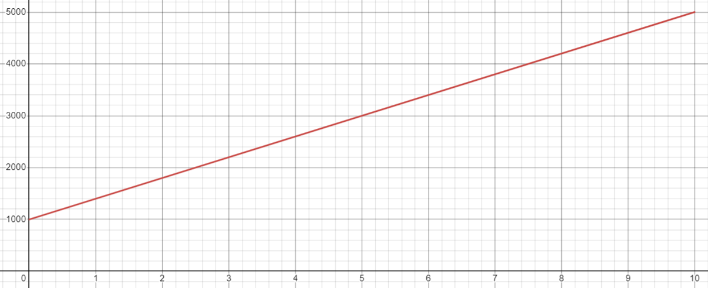

# Humanity

Humanity is very important in Questfall, as it is the limited resource that is consumed during quest mining, and therefore prevents Sybil attacks. Each quest costs **15 Humanity** to complete, and each vote costs **1 Humanity** to cast. It's very similar to stamina in RPGs, but unlike stamina, Humanity can be negative, and obviously if a user doesn't have enough Humanity, he won't be able to complete quests or cast votes.


Completing quests allows users to mine and earn in the present, while voting allows users to level up and increase the efficiency of mining in the future.


The main way for a user to gain Humanity is by completing challenges, which are a special type of quest with some additional restrictions, the most important of which is that the user cannot choose which challenge to complete - the system will give challenges to users in a random order.

The user can bypass the current challenge and move on to the next one, but his Humanity will decrease by 1,000**.** Therefore, bypassing many challenges in a row will reduce the user's Humanity to a very negative value, and the user will need to complete about a third of the number of challenges he has bypassed to restore his Humanity.


Users can also report the current challenge to bypass it, and if the community vote decides that the report is valid and there is something wrong with a challenge, it will be deactivated, and the reporter's Humanity will be increased by 10,000. Otherwise, the reporter's Humanity will be decreased by 10,000.


As challenges cannot be freely bypassed, they are, in contrast to quests, pre-moderated by the community. In the pre-moderation phase, users decide whether the challenge is appropriate, feasible and unique. They will also check that the challenge has an individual answer for each user, which is an important security requirement.


For example, writing "New York" backwards is a bad challenge because it gives the same answer for every account, whereas writing usernames backwards gives individual answers and makes it harder to automate for many accounts.


During pre-moderation, the community will assign a difficulty level to a challenge, which will result in a certain amount of Humanity being awarded to users for completing it. The difficulty level can range from 0 to 10, and the Humanity gain will vary accordingly from 1,000 to 5,000.



<figure><figcaption></figcaption></figure>



The Humanity earned by completing a challenge is calculated according to the following formula, depending on the difficulty of the challenge:

$$
Humanity=400*ChallengeDifficulty+1000
$$

For example, for the 3.4 challenge difficulty, Humanity is calculated as such: $$400*3.4+1000=2360$$.



With this approach, the medium difficulty (5.0) challenge will increase the user's Humanity by 3000, which will be enough to complete 200 quests (as each quest costs 15 Humanity). This should be enough for a full day of quest mining.

Besides challenges, users can gain Humanity by spending Credits, which are then burned. For 5 Credits, a user's Humanity increases by 10,000. In this way, a user adds value to the entire community by burning QFT for Credits.

As a result, Humanity can be earned by completing challenges that can't be automated by bots, or it can be bought with money (by burning QFT). Both approaches keep Humanity as a limited resource, making Sybil attacks impossible.
