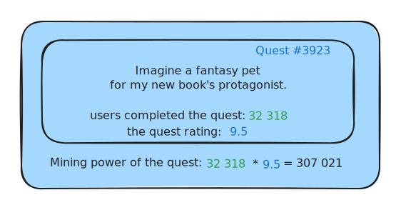

# ✨ Quest creation (10%)

Without motivation, authors create quests for no other reason than to promote their projects to the platform's audience, as can be seen on the popular existing quest platforms. This leads to the majority of quests being of very low quality, like silly tasks to join the Discord community or repost a tweet in X.

On the other hand, quest rewards that are valued by the platform community create a very different economic situation. In this case, authors can create any type of content and earn (without selling) by providing value to the crowd.

In order to achieve this, 10% of the weekly QFT fund will be distributed to users who have created quests with an end date this week, based on the popularity and rating the quest received while it was active.

The current status: <mark style="background-color:orange;">coming in Questfall v1.0</mark>&#x20;

***

### Distribution of rewards to authors

Each quest has an end date when it closes. At the end of the week, the system will collect all quests that have closed during the week and calculate each quest's mining power as the product of the quest completions and the quest's rating.


Since quest completion is moderated by the crowd, and quest ratings are based on a "majority wins" system, there is no way for malicious authors to abuse the system by creating a large number of pointless quests.


As the weekly QFT fund is a certain number of tokens, 10% of it is an exact known amount. This amount will be distributed to authors according to the share of mining power they earn from their quests that close during that week.
